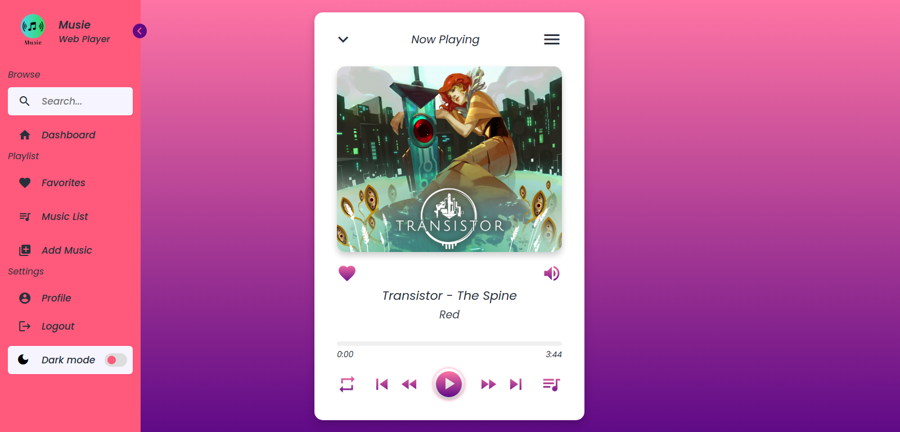

# 🎵 Musie: Local-First Audio Player

**Musie** es un reproductor de música moderno enfocado en la privacidad y la velocidad. Diseñado para revivir la colección musical local del usuario en cualquier dispositivo (PC, Tablet o Móvil) sin depender de la nube.

## 🚀 Visión del Producto
Musie busca ser la alternativa ligera y estética a los reproductores pesados actuales. Priorizamos:
1. **Privacidad Absoluta:** Tus archivos nunca salen de tu dispositivo.
2. **Fidelidad Sonora:** Control total mediante **Web Audio API** con ecualizador paramétrico.
3. **Multiplataforma:** Una sola base de código para Web y Android mediante **Capacitor**.

## 🛠️ Stack Tecnológico
*   **Core:** React 19 + Vite + TypeScript.
*   **Audio Engine:** Web Audio API (Custom Hooks para gestión de nodos).
*   **State Management:** Hooks de React + estado local por componentes.
*   **Storage:** IndexedDB para persistir metadatos y portadas de álbumes.
*   **Mobile Bridge:** Capacitor para el acceso nativo al sistema de archivos.

## 🌐 Demo Web Pública

- URL de la demo: https://nicovel98.github.io/musie/
- Deploy automático: GitHub Actions + GitHub Pages (rama main)

## ⚠️ Limitaciones de la Demo Web

1. La demo funciona en modo local-first del navegador: no sube tus canciones a ningún servidor.
2. El catálogo importado depende del almacenamiento del navegador (IndexedDB); si borras datos del sitio, se pierde la biblioteca local guardada.
3. En algunos navegadores móviles, la reproducción puede requerir interacción del usuario por políticas de autoplay.
4. Las búsquedas de portada online son opcionales y se activan por consentimiento; pueden fallar según disponibilidad del proveedor externo.
5. El build web no incluye todavía integración nativa de Android (Capacitor) ni reproducción en segundo plano del sistema operativo.

## 📋 Estado del Proyecto


| Fase          | Estado       | Descripción                                      |
| :------------ | :----------- | :----------------------------------------------- |
| **Prototipo** | ✅ Completado | Versión funcional inicial en PHP + JS.           |
| **Migración** | 🚧 En Proceso | Refactorización a React + TS + Vite.             |
| **Mobile**    | 📅 Pendiente  | Implementación de Capacitor y generación de AAB. |

## 🛠️ Instalación y Desarrollo
Si quieres colaborar o probar el entorno de desarrollo:

1. Clona el repositorio: `git clone https://github.com/Nicovel98/musie`
2. Instala dependencias: `npm install`
3. Inicia el servidor de desarrollo: `npm run dev`

## 🗺️ Roadmap de Desarrollo: Musie (30 Días)

Este plan detalla la evolución de Musie desde un prototipo PHP/JS hacia una aplicación híbrida profesional.

- [docs/ROADMAP.md](docs/ROADMAP.md)

## 🏷️ Naming e Identidad

Estandar oficial de nombres, appId y configuracion para web/Android:

- [docs/NAMING.md](docs/NAMING.md)

### Scripts recomendados en `package.json`
```json
{
  "scripts": {
    "dev": "vite",
    "build": "tsc -b && vite build",
    "preview": "vite preview",
    "lint": "eslint .",
    "format": "prettier . --write",
    "typecheck": "tsc --noEmit"
  }
}
```

## 📦 Progreso Actual (Abril 2026)

Estado resumido del roadmap:

1. Semana 1 completada: base React + TypeScript, core del player y carga local inicial.
2. Semana 2 completada: metadatos, biblioteca con búsqueda/filtros, cola con reanudación de sesión, responsive y optimización para listas largas.
3. Demo web pública activa con despliegue automático por GitHub Actions + GitHub Pages.
4. Siguiente etapa: Semana 3 (Web Audio API + presets + base de testing reforzada).

Para detalle diario y plan completo, ver [docs/ROADMAP.md](docs/ROADMAP.md).

## ⚠️ Riesgos Identificados
1.  **Permisos de Archivos:** Android 13+ es estricto con el acceso a multimedia; requiere configuración especial en el `AndroidManifest`.
2.  **Rendimiento:** Escanear miles de archivos locales puede bloquear el hilo principal; se evaluará el uso de *Web Workers*.
3.  **Firma de App:** Perder la `keystore` impediría actualizar la app en el futuro.

## 🎨 Diseño y UI base
El diseño se centra en la legibilidad y una estética moderna (Glassmorphism). Puedes consultar el archivo original aquí:

*   **Figma:** [Ver Diseño en Figma](https://www.figma.com/file/C4ZuwHwHuSWdgDzrsM8DDT/Reproductor-de-m%C3%BAsica%3A-Musie?node-id=0%3A1&t=qdhn0wQ1TfIcGm7J-1)
*   **Preview del Prototipo:**
    
## Nota Importante sobre Licencias

Si en el futuro se maneja musica que no sea del propio usuario, se deben validar derechos/licencias antes de publicacion comercial.