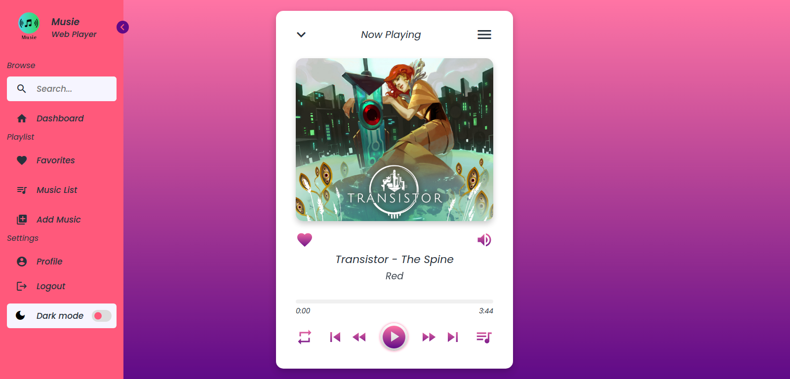

# 🎵 Musie: Local-First Audio Player

**Musie** es un reproductor de música moderno enfocado en privacidad y velocidad, diseñado para revivir la colección musical local sin depender de la nube.

## 🚀 Visión del Producto
Musie busca ser la alternativa ligera y estética a los reproductores pesados actuales. Priorizamos:
1. **Privacidad Absoluta:** Tus archivos nunca salen de tu dispositivo.
2. **Fidelidad Sonora:** Control total mediante **Web Audio API** con ecualizador paramétrico.
3. **Multiplataforma:** Una sola base de código.

## 🛠️ Stack Tecnológico
- React + Vite + Typescript + Tailwind
- Web Audio API
- IndexedDB para persistencia
- Lucide React: Iconos minimalistas y ligeros (Heart, ChevronDown, Play, Pause).
- Howler.js Para manejar el audio.
- Web Audio API: crear el Visualizer, para analizar las frecuencias en tiempo real.
- Framer Motion para animaciones suaves.

## 🚀 Quick Start

```bash
cd frontend
npm install
npm run dev
```

Abre http://localhost:5173 en tu navegador.

## 🌐 Demo Web
- [Demo en vivo](https://nicovel98.github.io/musie/)
- Deploy automático: GitHub Actions + GitHub Pages

## 📋 Documentación
- **Roadmap & Planificación:** [docs/ROADMAP.md](docs/WIREFRAME_REPRODUCTOR.md)

## 🎨 Diseño
El diseño se centra en la legibilidad y una estética moderna (Glassmorphism).

- **Figma:** [Ver Diseño en Figma](https://www.figma.com/file/C4ZuwHwHuSWdgDzrsM8DDT/Reproductor-de-m%C3%BAsica%3A-Musie?node-id=0%3A1&t=qdhn0wQ1TfIcGm7J-1)
- **Preview:** 